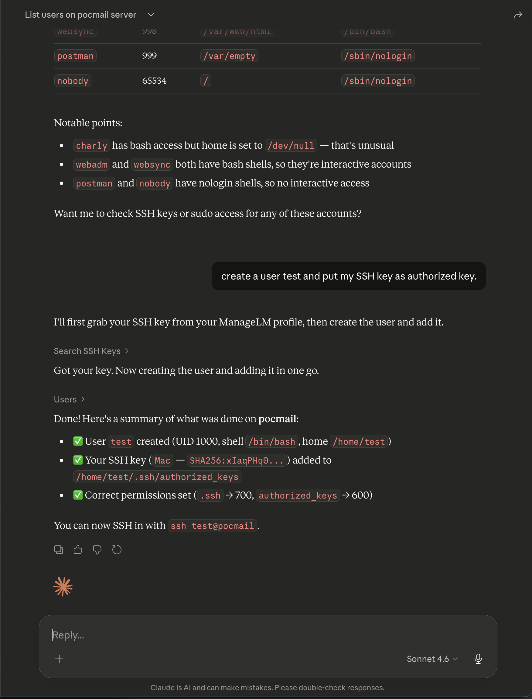

<p align="center">
  <a href="https://www.managelm.com">
    
  </a>
</p>

<h3 align="center">Claude Code Extension</h3>

<p align="center">
  Manage Linux &amp; Windows servers directly from Claude using natural language.
</p>

<p align="center">
  <a href="LICENSE"></a>
  <a href="https://www.managelm.com"></a>
  <a href="https://www.managelm.com/plugins/claude.html"></a>
  <a href="https://github.com/managelm/claude-extension/releases"></a>
</p>

<p align="center">
  
</p>

---

Ask Claude to check system status, manage packages, configure services, transfer files, run security audits, and more — across one server or an entire fleet. The extension connects Claude to your infrastructure through MCP (Model Context Protocol), a secure cloud portal, and lightweight agents running on your servers.

## Features

- **Natural language** — describe tasks in plain English; Claude picks the right skill and parameters
- **31 built-in skills** — packages, services, firewall, web servers, databases, Docker, certificates, VPN, Kubernetes, and more
- **Multi-server targeting** — run on a single server, a group, or broadcast to all agents
- **File transfers** — upload and download files (text and binary) between local and remote
- **Security audits** — run audits, search findings across your fleet, remediate issues
- **Task history & revert** — review what changed, inspect diffs, revert any task
- **Cross-infrastructure search** — find agents by health/OS, search inventory, security findings, SSH keys, sudo rules
- **Zero inbound ports** — agents connect outbound only; no SSH, no open ports on your servers

## Quick Start

### 1. Install

```bash
claude mcp add managelm --transport url https://app.managelm.com/mcp
```

Or add manually to `~/.claude/settings.json`:

```json
{
  "mcpServers": {
    "managelm": {
      "type": "url",
      "url": "https://app.managelm.com/mcp"
    }
  }
}
```

### 2. Authenticate

ManageLM uses **OAuth 2.0 with Dynamic Client Registration** (RFC 7591). On first connection, Claude self-registers as an OAuth client and opens your browser to authorize access — no client ID or secret to copy. All you need is a [ManageLM account](https://app.managelm.com/register) (free for up to 10 agents).

### 3. Use it

```
> Check disk usage on web-prod-01

> Install nginx on all servers in the staging group

> Upload my local config.yml to /etc/myapp/config.yml on db-primary

> Run a security audit on all production servers

> Which servers have CPU usage above 80%?

> Create a user deploy with my SSH key on web-prod-01
```

## Architecture

```
Claude ── MCP ──> ManageLM Portal ── WebSocket ──> Agent on Server
                  (cloud control      (outbound       (local LLM,
                   plane)              only)            skill exec)
```

Every task dispatched to an agent is cryptographically signed (Ed25519). Agents use a local LLM — your data never leaves your infrastructure.

## Available Skills

| Skill | Description |
|-------|-------------|
| `base` | Read-only utilities — files, system info, monitoring, diagnostics |
| `system` | OS config, performance tuning, hostname, timezone, kernel |
| `packages` | Install, remove, update across apt/dnf/yum/pacman/zypper/apk |
| `services` | Systemd units, cron jobs, logs, process control |
| `users` | Accounts, groups, SSH keys, sudo, password policies |
| `network` | Interfaces, routes, DNS, ports, connectivity |
| `security` | Audits, fail2ban, SSH hardening, SELinux/AppArmor, SSL/TLS |
| `files` | Read, write, upload, download files (text and binary) |
| `firewall` | iptables, nftables, firewalld, ufw |
| `docker` | Containers, images, compose, volumes, networks |
| `nginx` | Server blocks, reverse proxy, SSL, load balancing |
| `apache` | Virtual hosts, modules, SSL, configuration |
| `mysql` | Databases, users, queries, backups, replication |
| `postgresql` | Databases, roles, queries, backups, extensions |
| `kubernetes` | Pods, deployments, services, logs, kubectl |
| ...and more | Backup, certificates, git, DNS, VPN, LLM server, etc. |

## Discovery & Management Tools

| Tool | Description |
|------|-------------|
| `search_agents` | List all servers (status, OS, health, groups) or filter by CPU/memory/disk, OS, status, group |
| `get_agent_info` | Detailed info for a single server |
| `search_inventory` | Search packages, services, containers across fleet |
| `search_security` | Search security findings across fleet |
| `run_security_audit` | Trigger a security audit on one or more servers |
| `run_inventory_scan` | Trigger an inventory scan |
| `get_task_status` | Check status of running/completed tasks |
| `get_task_changes` | View file diffs from a task |
| `revert_task` | Undo file changes from a previous task |
| `send_email` | Send yourself a report or summary |

## Portal

<p align="center">
  
</p>

## Self-Hosted

Replace `app.managelm.com` with your own portal URL in the MCP configuration. See the [self-hosted guide](https://www.managelm.com/doc/) for Docker deployment.

## Requirements

- **Claude Code v1.0.33+** or Claude Desktop with MCP support
- **ManageLM account** — [sign up free](https://app.managelm.com/register) (up to 10 agents)
- **ManageLM Agent** — installed on each server you want to manage

## Other Integrations

ManageLM works with your favorite tools:

- [VS Code Extension](https://github.com/managelm/vscode-extension) — `@managelm` in Copilot Chat
- [ChatGPT Plugin](https://github.com/managelm/openai-gpt) — manage servers from ChatGPT
- [n8n Plugin](https://github.com/managelm/n8n-plugin) — infrastructure automation workflows
- [Slack Plugin](https://github.com/managelm/slack-plugin) — notifications and commands in Slack
- [OpenClaw Plugin](https://github.com/managelm/openclaw-plugin) — OpenClaw integration

## Links

- [Website](https://www.managelm.com)
- [Full Documentation](https://www.managelm.com/plugins/claude.html)
- [Portal](https://app.managelm.com)

## License

[Apache 2.0](LICENSE)
